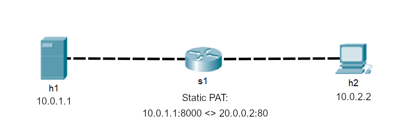

# Simple static PAT for TCP trafic. 

## Introduction
The objective of this tutorial is to implement PAT protocol for TCP trafic.

Static PAT example:



Port **10.0.1.1:8000** should be available in global network (right side of router) with address **20.0.0.2:80**. Packets to others ports of 20.0.0.2 or to any port of 10.0.1.1 **should be dropped**.

## Step 1: Fill *TODOs* 
You need to fill *TODOs* in file `static_pat.p4` that will handle translation of the TCP/IP addresses. 

Your job will be to do the following:

1. **TODO:** Fill actions that sets source/destination address and port to values passed as parameters (they will be used by global/local PAT tables)
2. **TODO:** Fill global PAT table declaration (match source IP and port and map it to new IP and port)
3. **TODO:** Fill local PAT table declaration (match destination IP and port and map it to new IP and port)
4. **TODO:** Apply global PAT table to packets coming from "local" network
5. **TODO:** Apply local PAT table to packets coming from "global" network
6. **TODO:** Drop packets that couldn't be translated
7. **TODO:** Add entries to tables declared above in `s1-runtime.json`

If you have some problems you can check folder `solution` to see an example solution.


## Step 2: Run program
In your shell, run:
 ```bash
   make
```
This will:
* compile `static_pat.p4`, and

* start a Mininet instance with one switches (`s1`) connected to
    two hosts (`h1`, `h2`).
* The hosts are assigned IPs of `10.0.1.1` and `10.0.2.2`.


* Port `10.0.1.1:8000` of the host h1 should be accessible globally as port `20.0.0.2:80`

Open two **Wiresharks** and choose select `s1-eth1` and `s1-eth2` interfaces to monitor both sides of the switch.

Then, inside mininet you can run
```bash
   h1 python3 -m http.server  # Setup http server on host h1 on port 8000
   h2 wget 20.0.0.2           # Send GET request to the h1 host
```
This will check if you performed translation correctly.

Then, you can check on `Wiresharks` to inspect packets in depth.

You should also check if request to "10.0.1.1" is not reaching the h1:
```bash
   h2 wget 10.0.1.1:8000      # Should not connect
```
You can check that by running above command and checking **Wireshark** connected to `s1-eth2`.

If you implmented the excersise succesfully you shouldn't see packet comming from `20.0.0.2:80` to
`10.0.2.2` as a response to above command.